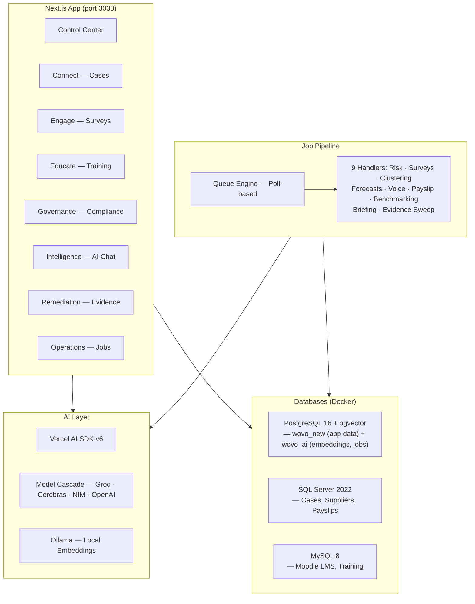

# WOVO+

AI-powered supply chain due diligence platform. WOVO+ helps brands **detect** labor risks through worker grievances, surveys, and wage analysis — **act** with AI-guided case resolution and targeted training — and **evidence** compliance actions for regulatory audits.

## Architecture at a Glance



## Tech Stack

| Layer | Technology |
|-------|-----------|
| Framework | Next.js 16, React 19, TypeScript 5.9 |
| Styling | Tailwind CSS 4, shadcn/ui, Radix UI |
| ORM | Drizzle ORM (PostgreSQL) |
| Databases | PostgreSQL 16 + pgvector (2 DBs: wovo_new, wovo_ai), SQL Server 2022, MySQL 8 |
| AI | Vercel AI SDK v6, multi-provider cascade |
| State | TanStack React Query, nuqs (URL state) |
| Charts | Recharts, React Flow, React Simple Maps, D3 |
| PDF | jsPDF + jspdf-autotable |
| Runtime | Bun |

## Prerequisites

- **Node.js >= 22** — install via [fnm](https://github.com/Schniz/fnm): `fnm use 22`
- **Bun** — [bun.sh](https://bun.sh) (used instead of npm/npx)
- **Docker Desktop** — runs 3 database containers
- **Git**
- **Optional:** [Ollama](https://ollama.com) — for local embeddings (case-clustering job)

## Quickstart

### 1. Clone and install

```bash
git clone https://github.com/vishalkdotcom/wovo.git
cd wovo
bun install
```

### 2. Start databases

```bash
docker compose up -d
```

This starts PostgreSQL (port 5432), SQL Server (port 1433), and MySQL (port 3306). SQL Server takes ~30 seconds to initialize — wait for the health check before proceeding.

### 3. Push schema and seed data

```bash
bun run db:push        # Push Drizzle schema to PostgreSQL (wovo_ai database)
bun run seed-all       # Seed all databases with demo data
```

> **Note:** The PostgreSQL container hosts 2 databases: `wovo_new` (app data, Engage) and `wovo_ai` (embeddings, jobs, analytics). `db:push` targets `wovo_ai` via Drizzle ORM. Both PostgreSQL databases plus SQL Server and MySQL schemas are initialized by Docker init scripts in `init/`.

### 4. Configure environment

```bash
cp .env.example .env.local
```

The defaults work with Docker out of the box for all 3 databases. The one thing you need is at least one AI API key for pipeline jobs:

- **Groq** (free 500K tokens/day): [console.groq.com](https://console.groq.com)
- **Cerebras** (free 1M tokens/day): [cloud.cerebras.ai](https://cloud.cerebras.ai)

Set `GROQ_API_KEY` or `CEREBRAS_API_KEY` in `.env.local`.

See `.env.example` for all available configuration including AI provider selection, rate limit overrides, and logging options.

### 5. Start dev server

```bash
bun run dev
```

Open [http://localhost:3030](http://localhost:3030).

## Project Structure

```
wovo/
├── app/                    # Next.js App Router
│   ├── api/                # 72+ API route handlers (see docs/API_REFERENCE.md)
│   ├── connect/            # Case management pages
│   ├── engage/             # Worker voice / survey pages
│   ├── educate/            # Training course pages
│   ├── governance/         # Regulatory compliance pages
│   ├── intelligence/       # AI briefing & regional insights
│   ├── remediation/        # Remediation plan pages
│   ├── operations/         # Job pipeline monitoring
│   ├── suppliers/          # Supplier detail pages
│   ├── brands/             # Brand/parent company pages
│   └── settings/           # System settings
├── components/             # React components by module
│   ├── ai/                 # Chat, briefing, artifacts
│   ├── cases/              # Case management UI
│   ├── connect/            # Connect module charts
│   ├── dashboard/          # Control center widgets
│   ├── engage/             # Survey/voice trend charts
│   ├── governance/         # Compliance matrix, framework cards
│   ├── help/               # Contextual infographic system
│   ├── operations/         # Job management UI
│   ├── remediation/        # Remediation plan components
│   ├── suppliers/          # Supplier detail views
│   └── ui/                 # shadcn/ui primitives
├── lib/                    # Core libraries
│   ├── ai/                 # Provider config, cascade, rate limiter, prompts
│   ├── db/                 # Database connections (Drizzle, mssql, mysql2, pg)
│   ├── jobs/               # Queue engine + 9 job handlers
│   ├── remediation/        # Remediation business logic
│   └── services/           # Cross-cutting services
├── init/                   # Docker DB init scripts (schema + seed SQL)
│   ├── mysql/              # Moodle schema
│   ├── postgres/           # wovo_new + wovo_ai schemas
│   └── sqlserver/          # Connect module schema + seed data
├── scripts/                # Bun scripts for seeding and maintenance
├── drizzle/                # Drizzle migration files
├── docs/                   # Extended documentation
├── docker-compose.yml      # 3 database containers
├── drizzle.config.ts       # Drizzle ORM configuration
└── .env.example            # Environment variable template
```

## Modules

### Control Center (Dashboard)

The main dashboard aggregates risk scores, alerts, ML insights, and activity streams across all modules. Includes geographic risk heatmap, supply chain network visualization, and risk distribution charts.

### Connect

Worker grievance case management sourced from SQL Server. Features AI-powered case summarization, severity tagging, guidance recommendations, draft response generation, and case clustering via pgvector embeddings. Includes payslip anomaly detection for wage compliance.

### Engage

Worker voice analytics from survey responses. Deploys surveys, runs AI sentiment analysis and theme extraction, tracks temporal sentiment patterns, and surfaces monthly topic trends per supplier.

### Educate

Training course management via Moodle/iOMAD LMS (MySQL). Supports AI-powered course generation from PDF policy uploads, quiz generation, multi-language translation, and training completion tracking per supplier.

### Governance

Regulatory compliance tracking against frameworks like EU CSDDD and UK Modern Slavery Act. Provides a compliance matrix per supplier and links requirements to evidence from other modules.

### Intelligence

Cross-module AI insights including a conversational AI assistant with 29 multi-module tools, daily intelligence briefings, regional benchmarking, and ML-generated insight cards.

### Remediation

Remediation plan creation and tracking with evidence collection. Links resolved cases, training completions, and survey improvements as proof of corrective action. Supports HRDD narrative PDF export for regulatory audits.

### Operations

Background job pipeline monitoring. 9 job types (risk scoring, survey analysis, case clustering, payslip anomaly detection, risk forecasting, worker voice analytics, regional benchmarking, briefing generation, evidence sweep) with scheduling, retry, and queue status views.

## Available Scripts

| Command | Purpose |
|---------|---------|
| `bun run dev` | Start dev server on port 3030 |
| `bun run build` | Production build |
| `bun run start` | Start production server |
| `bun run lint` | Run ESLint |
| `bun run db:push` | Push Drizzle schema to PostgreSQL |
| `bun run db:generate` | Generate Drizzle migration files |
| `bun run db:migrate` | Run Drizzle migrations |
| `bun run db:studio` | Open Drizzle Studio (visual DB editor) |
| `bun run db:seed` | Seed risk scores only |
| `bun run seed-all` | Seed all 3 databases with demo data |
| `bun run reseed` | Re-seed preserving ML job outputs |

## Further Reading

- [API Reference](docs/API_REFERENCE.md) — all 72+ endpoints grouped by module
- [Contributing Guide](CONTRIBUTING.md) — development workflow, conventions, and guides
- [Environment Variables](.env.example) — all configuration options with defaults
- [Implementation Plan](docs/IMPLEMENTATION_PLAN.md) — detailed technical execution plan
