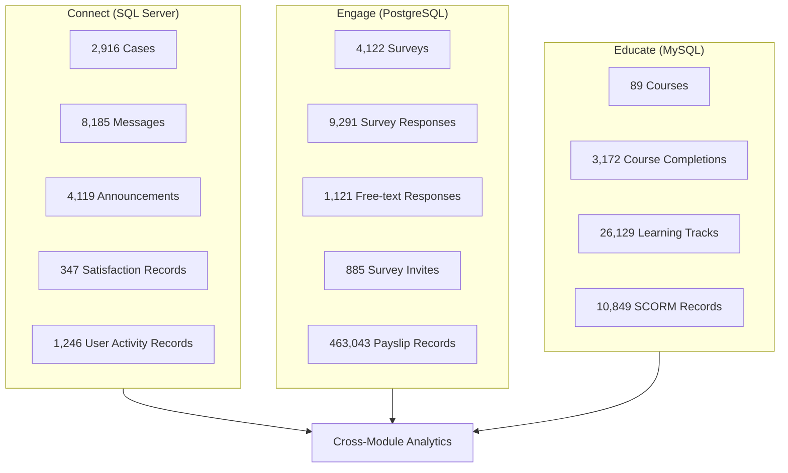

# WOVO AI Features Roadmap

> **Purpose**: This document consolidates AI feature ideas, data feasibility analysis, and implementation priorities for the WOVO platform. It serves as the single source of truth for AI-related development planning.
>
> **Last Updated**: January 2026

---

## Executive Summary

WOVO's three modules (Connect, Engage, Educate) contain rich data that can power meaningful AI features. Based on database analysis across PostgreSQL, SQL Server, and MySQL:

- **✅ Most AI features are immediately feasible** with existing data
- **⚠️ Some features need cross-database ID mapping** (Company ↔ Client ↔ mdl_company)
- **❌ Few features require external data sources** (time & attendance, turnover metrics)

### Strategic Alignment

AI should focus on:

1. **Improving and interpreting existing data** — not building flashy worker-facing chatbots
2. **Helping humans work faster** — copilot-style assistance for case handling, survey design, lesson authoring
3. **HRDD evidence generation** — regulatory compliance narratives and risk documentation

---

## Module Overview



---

## Phase 1: Immediately Feasible (Weeks 1-4)

### 1.1 Case Summarization & Auto-Tagging

| Attribute       | Details                                                             |
| --------------- | ------------------------------------------------------------------- |
| **Module**      | Connect                                                             |
| **Status**      | 🟢 Ready to Build                                                   |
| **Data Source** | `Message.MessageText`, `CaseNote.Notes`, `CaseTypeCultureText.Name` |
| **Effort**      | Medium                                                              |

**What it does:**

- Summarize long complaint messages into 1-2 sentences
- Suggest case type and severity from existing taxonomy
- Translate multi-language complaints
- Draft response templates based on case type

**Key Data Points:**

- 8,185 messages with `MessageText` content
- 11 case type categories (wages, harassment, safety, etc.)
- PIC assignment taxonomy (HR, Facilities, Management)

> [!TIP]
> Start with summarization first—it's the lowest-risk, highest-value feature. Auto-tagging can come later with human-in-the-loop validation.

---

### 1.2 Survey Text Analysis & HRDD Insights

| Attribute       | Details                                           |
| --------------- | ------------------------------------------------- |
| **Module**      | Engage                                            |
| **Status**      | 🟢 Ready to Build                                 |
| **Data Source** | `survey_mdlsurveyquestionresponses.text_response` |
| **Effort**      | Medium                                            |

**What it does:**

- Identify top risk themes from free-text survey responses
- Generate HRDD narratives suitable for due diligence reports
- Segment analysis by demographics (country, department, tenure, gender)
- Compare surveys over time for trend detection

**Key Data Points:**

- 1,121 free-text responses available
- Rich demographics: country, gender, age_label, tenure_label, dept_name, job_role
- Reporting categories: "Compensation", "Well Being", "Skill Building"

---

### 1.3 Survey/Questionnaire Design Assistant

| Attribute       | Details                                                  |
| --------------- | -------------------------------------------------------- |
| **Module**      | Engage                                                   |
| **Status**      | 🟢 Ready to Build                                        |
| **Data Source** | `survey_mdlsurveyquestions`, `survey_mdlsurveytemplate*` |
| **Effort**      | Low                                                      |

**What it does:**

- Generate survey questions based on topic description
- Suggest questions from existing templates
- Simplify language for worker readability
- Auto-translate to supported languages

**Example User Flow:**

```
User: "I need a short pulse survey for Bangladesh sewing workers about overtime and rest days"

AI generates:
- 5-8 questions (Likert, multiple-choice, yes/no)
- Both English + Bengali versions (as drafts)
- Flags sensitive wording for review
```

---

### 1.4 Lesson Authoring Copilot

| Attribute       | Details                                          |
| --------------- | ------------------------------------------------ |
| **Module**      | Educate                                          |
| **Status**      | 🟢 Ready to Build                                |
| **Data Source** | `mdl_course.summary`, existing lessons structure |
| **Effort**      | Medium                                           |

**What it does:**

- Draft lessons from policy documents/codes of conduct
- Propose lesson structure (sections, learning objectives)
- Generate quiz questions
- Simplify language to worker reading level
- Suggest translations

**Relevant Course Categories:**

- "Sexual Harassment Prevention"
- "Social Compliance"
- "Grievance Handling"
- "Fair Working Conditions"
- "Financial Planning"

---

## Phase 2: Feasible with Minor Preparation (Months 1-2)

### 2.1 Risk Score Calculator

| Attribute        | Details                                                                |
| ---------------- | ---------------------------------------------------------------------- |
| **Module**       | Cross-Module                                                           |
| **Status**       | 🟢 Ready to Build (ID Mapping Verified)                                |
| **Prerequisite** | [Cross-DB Company ID Mapping](#cross-database-id-mapping) ✅ Confirmed |
| **Effort**       | High                                                                   |

**Risk Score Formula:**

```
Factory Risk Score =
  (Case severity score) +
  (Survey risk themes score) +
  (Training completion score) +
  (Engagement score) +
  (Satisfaction score)
```

**Data Available:**

- Case trends by company (SQL Server)
- Survey scores by client (PostgreSQL)
- Training completion rates (MySQL)
- Case satisfaction ratings (SQL Server - 57% satisfied rate)

> [!IMPORTANT]
> Risk scoring must be "explainable"—regulators and NGOs will ask "Why is this factory rated Red?"

---

### 2.2 Lesson Recommendation Engine

| Attribute       | Details                                     |
| --------------- | ------------------------------------------- |
| **Module**      | Cross-Module                                |
| **Status**      | 🟢 Ready to Build (ID Mapping Verified)     |
| **Data Source** | Case types + Survey themes → Course catalog |
| **Effort**      | Medium                                      |

**What it does:**

- Link case types and survey themes to relevant courses
- Example: "Harassment complaints rising" → Recommend "Sexual Harassment Prevention" course
- Personalize learning paths based on company, department, past completions

**Mapping Logic:**
| Issue Type | → | Recommended Course |
|------------|---|-------------------|
| Overtime complaints | → | "Wage & Hours 101" |
| Harassment cases | → | "Sexual Harassment Prevention" |
| Grievance handling gaps | → | "Understanding Grievances" |
| Safety incidents | → | "Occupational Health & Safety" |

---

### 2.3 Case "Next Best Action" Guidance

| Attribute       | Details                                      |
| --------------- | -------------------------------------------- |
| **Module**      | Connect                                      |
| **Status**      | 🟡 Pattern Mining Needed                     |
| **Data Source** | Historical resolved cases + `CaseNote.Notes` |
| **Effort**      | Medium                                       |

**What it does:**

- Analyze resolved cases to extract common resolution patterns
- Suggest investigation steps based on case type
- Draft response templates (always for human review)

> [!CAUTION]
> AI-generated case responses must **always be draft-only** for human review. Never bypass existing case flow roles.

---

### 2.4 Worker Engagement Score

| Attribute       | Details                                          |
| --------------- | ------------------------------------------------ |
| **Module**      | Connect                                          |
| **Status**      | 🟢 Data Available (New Discovery)                |
| **Data Source** | `tblUserActivityHistrory`, `CompanyPostResponse` |
| **Effort**      | Medium                                           |

**What it does:**
Combine multiple engagement signals:

- Module visit frequency (Home, Connect, Survey, Learn, PaySlip, FAQ, etc.)
- Announcement read rates (1.9M+ records available)
- Survey response rates
- Case satisfaction ratings

**Output:** Worker engagement score per factory/company

---

## Phase 3: Future Capabilities (Quarter 1+)

### 3.1 MCP Server for Brands

| Attribute  | Details                                                                                                                                                    |
| ---------- | ---------------------------------------------------------------------------------------------------------------------------------------------------------- |
| **Status** | 🟡 Architecture Work Needed                                                                                                                                |
| **Model**  | Similar to [Atlassian Rovo MCP Server](https://support.atlassian.com/atlassian-rovo-mcp-server/docs/getting-started-with-the-atlassian-remote-mcp-server/) |
| **Effort** | High                                                                                                                                                       |

**What it enables:**
Brand compliance managers can use ChatGPT/Claude to query WOVO data:

- "Show me key worker voice risks in Vietnam in the last 6 months."
- "Generate an HRDD narrative using the last year of WOVO cases and surveys for Supplier X."
- "List factories with repeated harassment-related grievances and summarize remediation."

**Proposed MCP Tools:**

```typescript
list_suppliers() → Companies with hierarchy
get_cases(supplier_id, filters) → Cases with categories, status
get_survey_summary(supplier_id) → Aggregated survey results
get_risk_metrics(supplier_id) → Calculated risk indicators
get_lesson_completion(supplier_id) → Training status
```

**Security Requirements:**

- OAuth 2.1 authentication
- Scoped tokens per brand/account
- Aggregation/anonymization logic
- Audit logging for all MCP calls

---

### 3.2 Cross-Module Risk Triangulation

> [!TIP]
> With all three database IDs now verified as matching, this is now much more feasible than originally estimated.

| Attribute  | Details                 |
| ---------- | ----------------------- |
| **Status** | 🟢 ID Mappings Verified |
| **Effort** | High                    |

**Full correlation across all three modules:**

```
Example insight:
"Factory X has:
  - High harassment cases (Connect)
  - Low survey scores on 'respectful treatment' (Engage)
  - Low completion of harassment training (Educate)

→ Recommended action: Priority harassment prevention intervention"
```

---

### 3.3 Proactive Risk Detection

| Attribute    | Details                                                 |
| ------------ | ------------------------------------------------------- |
| **Status**   | ❌ Requires External Data                               |
| **Data Gap** | Time & attendance, absenteeism, shift/overtime tracking |
| **Effort**   | Very High                                               |

**What's missing:**

- Time & attendance data
- Absenteeism records
- Shift/overtime tracking
- Integration with supplier HR systems

---

## Data Preparation Requirements

### Cross-Database ID Mapping

> [!NOTE]
> **✅ ALL MAPPINGS VERIFIED** - A single Company ID works across all three databases!

**Confirmed Mapping (All Three DBs):**

```sql
-- Single ID works across all databases:
-- SQL Server: Company.Id
-- PostgreSQL: clients_clientinfo.client_key
-- MySQL: mdl_company.id

-- Verified matches:
-- TriHealth EAP: 16 across all DBs
-- Imperial Health a+ Work: 23 across all DBs
-- SAVE EAP: 24 across all DBs
-- Cigna Global: 54 across all DBs
```

| DB Pair                 | Status           | Join Key                      |
| ----------------------- | ---------------- | ----------------------------- |
| PostgreSQL ↔ SQL Server | ✅ **CONFIRMED** | `client_key = Company.Id`     |
| PostgreSQL ↔ MySQL      | ✅ **CONFIRMED** | `client_key = mdl_company.id` |
| SQL Server ↔ MySQL      | ✅ **CONFIRMED** | `Company.Id = mdl_company.id` |

**No additional mapping table required** - direct joins possible using existing IDs.

---

### Worker Count Calculation

Previously flagged as a gap—now feasible via payslip data:

```sql
-- Get worker count per client from payslip recipients (PostgreSQL)
SELECT
  p.client_id,
  ci.name as company_name,
  COUNT(DISTINCT pe.employee_id) as worker_count,
  MAX(pe.created_date) as last_payslip_date
FROM payslip p
INNER JOIN payslip_employee pe ON p.id::bigint = pe.payslip_id
INNER JOIN clients_clientinfo ci ON p.client_id = ci.id
WHERE p.is_deleted = false
GROUP BY p.client_id, ci.name
ORDER BY worker_count DESC
```

This enables "cases per 100 workers" metric for risk scoring.

---

### Training Completion Data (MySQL - SCORM Tracking)

> [!WARNING]
> **Important Discovery:** `mdl_course_completions.timecompleted` shows 0 completions, but `mdl_scorm_scoes_track` has the actual pass/fail/incomplete data.

**Use SCORM tracking for real completion data:**

```sql
-- MySQL - ACTUAL completion status (not mdl_course_completions)
SELECT
  scormid,
  COUNT(DISTINCT userid) as total_users,
  SUM(CASE WHEN value = 'passed' THEN 1 ELSE 0 END) as passed,
  SUM(CASE WHEN value = 'failed' THEN 1 ELSE 0 END) as failed,
  SUM(CASE WHEN value = 'incomplete' THEN 1 ELSE 0 END) as incomplete
FROM mdl_scorm_scoes_track
WHERE element = 'cmi.core.lesson_status'
GROUP BY scormid
```

**Training completion by company:**

```sql
-- MySQL
SELECT
  t.companyid,
  c.name as company_name,
  COUNT(*) as total_enrollments,
  SUM(CASE WHEN t.timecompleted IS NOT NULL THEN 1 ELSE 0 END) as completed,
  AVG(t.finalscore) as avg_score
FROM mdl_local_iomad_track t
INNER JOIN mdl_company c ON t.companyid = c.id
GROUP BY t.companyid, c.name
ORDER BY total_enrollments DESC
```

---

### Cross-Module Risk View Query

With all ID mappings confirmed, you can now build the complete cross-module view:

```sql
-- Step 1: Get case metrics from SQL Server
SELECT
  CompanyId as company_id,
  COUNT(*) as case_count,
  AVG(CASE WHEN cs.Rating = 1 THEN 1.0 ELSE 0.0 END) as satisfaction_rate
FROM [Case] c
LEFT JOIN CaseSurvey cs ON c.Id = cs.CaseId
WHERE CompanyId = @company_id
GROUP BY CompanyId

-- Step 2: Get survey metrics from PostgreSQL
SELECT
  client_id as company_id,
  COUNT(*) as survey_responses,
  AVG(CASE WHEN text_response IS NOT NULL THEN 1 ELSE 0 END) as text_response_rate
FROM survey_mdlsurveyquestionresponses r
INNER JOIN survey_mdlsurveyuserresponses ur ON r.survey_user_response_id = ur.id
WHERE ur.client_id = @company_id
GROUP BY client_id

-- Step 3: Get training metrics from MySQL
SELECT
  companyid as company_id,
  COUNT(*) as enrollments,
  SUM(CASE WHEN t.value = 'passed' THEN 1 ELSE 0 END) as passed_count
FROM mdl_local_iomad_track lit
LEFT JOIN mdl_scorm_scoes_track t ON lit.userid = t.userid
WHERE companyid = @company_id
GROUP BY companyid

-- Step 4: Combine in application layer using company_id as join key
```

---

## Implementation Checklist

### Phase 1 (Weeks 1-4)

- [ ] Build Case Summarization POC using `Message.MessageText`
- [ ] Build Survey Text Analysis POC using `text_response` data
- [ ] Create Survey Design Assistant prototype
- [ ] Create Lesson Authoring Copilot prototype
- [ ] Use `CaseSurvey` for case quality metrics
- [ ] Use `mdl_scorm_scoes_track` for training completion (not mdl_course_completions)

### Phase 2 (Months 1-2)

- [x] ~~Establish cross-DB company ID mapping table~~ — **VERIFIED: IDs match across all DBs**
- [ ] Implement basic risk score calculator
- [ ] Build lesson recommendation engine
- [ ] Build cross-module risk view using confirmed ID mapping
- [ ] Create worker count aggregation from payslip data
- [ ] Integrate `CaseSurvey` satisfaction data into case analysis

### Phase 3 (Quarter 1+)

- [ ] Design MCP server API endpoints
- [ ] Implement OAuth + permission model for external access
- [ ] Build full cross-module triangulation dashboard
- [ ] Explore external HR system integrations for proactive detection

---

## Things to Avoid

> [!WARNING]
> These are explicitly **not recommended** based on strategy analysis:

1.  **Direct worker chatbots** answering sensitive HR questions
    - High risk of hallucination and bad advice
    - Legal complications across jurisdictions

2.  **AI freely generating case responses to workers**
    - Must always be draft-only for human review
    - Cannot bypass existing case flow roles

3.  **Overpromising predictive risk scoring**
    - Start with explainable, descriptive analytics
    - Regulators will scrutinize methodology

4.  **Heavy investment in worker-facing generative AI**
    - Safety concerns with low-literacy populations
    - Multi-language complexity
    - Better to keep AI internal/admin-facing first

---

## Data Quality Notes

**Strengths:**

- Good categorization taxonomy (CaseTypes cover key HRDD topics)
- Multi-language support across all modules
- Demographics in survey responses enable segmentation
- Company hierarchy exists in all three databases
- Rich course catalog with HRDD-relevant content (89 courses)
- 26,129 detailed learning tracks with scores
- 10,849 SCORM interaction records with actual pass/fail status
- **Consistent Company IDs across all three databases** ✅

**Concerns:**

- Many CaseTypes have no associated cases (test data present)
- Some cases have NULL CaseType
- Free-text is limited (~5% of survey responses)
- `mdl_course_completions` shows 0 completed (use `mdl_scorm_scoes_track` instead)
- This appears to be QA data, not production

---

## References

- [AI Feature Data Feasibility Analysis](.cursor/plans/ai_feature_data_feasibility_10b85a34.plan.md)
- [AI Data Gap Analysis](.cursor/plans/ai_data_gap_analysis_1d8a735a.plan.md)
- Source chats: [chat-1.md](../chat-1.md), [chat-2.md](../chat-2.md), [chat-3.md](../chat-3.md)
- [Atlassian Rovo MCP Server Documentation](https://support.atlassian.com/atlassian-rovo-mcp-server/docs/getting-started-with-the-atlassian-remote-mcp-server/)
