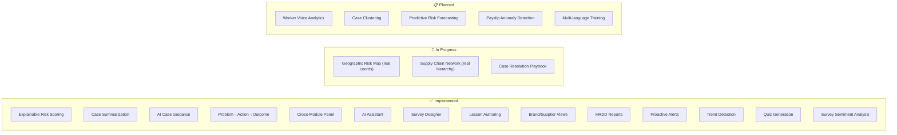

# SupplyChain+ Features Roadmap

> **Purpose**: User-journey focused roadmap connecting AI capabilities to UI/UX implementation.
>
> **Last Updated**: March 2026

---

## Implementation Status Overview

---

## User Journey 1: "Which suppliers need attention?"

**User Goal**: Quickly identify high-risk suppliers and understand why.

### Features

| Feature              | Status     | Location                        | What it Does                                                          |
| -------------------- | ---------- | ------------------------------- | --------------------------------------------------------------------- |
| Supplier Risk Score  | ✅ Done    | `/suppliers`, `/suppliers/[id]` | Composite score (0-100) from cases, surveys, training, engagement     |
| Explainable Risk     | ✅ Done    | `/suppliers/[id]`               | "Why HIGH Risk?" card showing component scores + contributing factors |
| Risk Trend Indicator | ✅ Done    | Dashboard, `/suppliers/[id]`    | Recharts line chart from `supplier_risk_history` with 30/60/90d views |
| Proactive Alerts     | ✅ Done    | Dashboard, Notifications        | Auto-generated when risk >= 75; severity-colored notification center  |

### Screenshot Reference

---

## User Journey 2: "How do I handle this case?"

**User Goal**: Resolve worker grievances efficiently with AI guidance.

### Features

| Feature            | Status  | Location                    | What it Does                          |
| ------------------ | ------- | --------------------------- | ------------------------------------- |
| Case Summarization | ✅ Done | `/connect`, `/connect/[id]` | 1-2 sentence summary of complaint     |
| Severity Auto-Tag  | ✅ Done | `/connect`                  | AI suggests high/medium/low           |
| AI Guidance Panel  | ✅ Done | `/connect/[id]`             | Recommended steps for investigation   |
| Draft Response     | ✅ Done | `/connect/[id]`             | Suggested reply to worker             |
| Related Training   | ✅ Done | `/connect/[id]`             | Courses to deploy for this issue type |
| Status Workflow    | ✅ Done | `/connect/[id]`             | Visual progress from New → Verified   |

### Screenshot Reference

---

## User Journey 3: "I need to create a survey"

**User Goal**: Design worker surveys quickly with AI assistance.

### Features

| Feature            | Status     | Location              | What it Does                              |
| ------------------ | ---------- | --------------------- | ----------------------------------------- |
| AI Survey Designer | ✅ Done    | `/engage`             | Text prompt → generated questions         |
| Question Preview   | ✅ Done    | `/engage`             | See questions before deploying            |
| Language Selection | ✅ Done    | `/engage`             | Choose English, Vietnamese, Bengali, etc. |
| Theme Extraction   | ✅ Done    | `/engage` survey list | Auto-extract themes from responses        |
| Text Analysis      | ✅ Done    | Survey Detail         | LLM-based sentiment analysis + theme extraction via batch job         |

---

## User Journey 4: "I need training content"

**User Goal**: Create compliance training from policy documents.

### Features

| Feature              | Status     | Location      | What it Does                                        |
| -------------------- | ---------- | ------------- | --------------------------------------------------- |
| PDF Upload           | ✅ Done    | `/educate`    | Drag-drop policy documents                          |
| Processing Pipeline  | ✅ Done    | `/educate`    | Visual: Uploading → Extracting → Generating → Ready |
| Recommended Training | ✅ Done    | `/educate`    | AI suggests courses based on supplier cases         |
| Lesson Generation    | ✅ Done    | `/educate`    | Real AI: PDF extraction + structured course via Vercel AI SDK         |
| Quiz Generation      | ✅ Done    | `/educate`    | Integrated with lesson pipeline; Zod-validated question schema        |
| Multi-language       | ⏳ Planned | Course Detail | Auto-translate to worker languages (UI ready, translation pending)    |

---

## User Journey 5: "I need an HRDD report"

**User Goal**: Generate regulatory compliance narratives for due diligence.

### Features

| Feature              | Status     | Location        | What it Does                            |
| -------------------- | ---------- | --------------- | --------------------------------------- |
| Narrative Generation | ✅ Done    | `/suppliers/[id]` | Real AI: 3-paragraph executive summary via `generateText`            |
| Supplier Summary     | ✅ Done    | `/suppliers/[id]` | HRDD PDF export with supplier profile + risk analysis via jsPDF      |
| Evidence Links       | ⏳ Planned | HRDD Export       | Link to source cases, surveys, training                              |
| Regulatory Templates | ✅ Done    | Export            | EU CSDDD + UK Modern Slavery Act templates with compliance footers   |

---

## User Journey 6: "What's happening across my supply chain?"

**User Goal**: Cross-module intelligence and conversational exploration.

### Features

| Feature                | Status  | Location          | What it Does                            |
| ---------------------- | ------- | ----------------- | --------------------------------------- |
| Cross-Module Panel     | ✅ Done | `/suppliers/[id]` | Cases + Surveys + Training in tabs      |
| Problem→Action→Outcome | ✅ Done | `/suppliers/[id]` | Timeline showing linked events          |
| AI Activity Stream     | ✅ Done | `/` Dashboard     | Recent AI actions across modules        |
| AI Assistant           | ✅ Done | `/ai`             | Conversational queries about suppliers  |
| Brand vs Supplier View | ✅ Done | Header            | Toggle portfolio vs single-factory view |

### Screenshot Reference

---

## Data Sources Reference

| Module  | Database   | Key Tables                             | Records           |
| ------- | ---------- | -------------------------------------- | ----------------- |
| Connect | SQL Server | Message, CaseNote, CaseTypeCultureText | 8,185 messages    |
| Engage  | PostgreSQL | survey_mdlsurveyquestionresponses      | 9,291 responses   |
| Educate | MySQL      | mdl_course, mdl_course_completions     | 3,172 completions |

### Cross-Database Mapping

- **Company ID** (SQL Server) ↔ **ClientId** (PostgreSQL) ↔ **mdl_company.id** (MySQL)
- Mapping verified ✅ — enables cross-module analytics

---

## Next Priorities

1. **Geographic Risk Map** — Replace hardcoded coordinates with real `CompanyPost.Latitude/Longitude`
2. **Supply Chain Network** — Replace simulated hierarchy with real `CompanyHierarchy`/`ParentCompanyId`
3. **Case Resolution Playbook** — Analyze resolved cases to extract best practices by type/region
4. **Evidence Links** — Add source tracing to HRDD PDF exports
5. **Multi-language Training** — LLM-based auto-translation of course content
6. **Worker Voice Analytics** — Batch NLP on survey responses for emerging themes (Phase 4)
7. **Case Clustering** — Embedding-based systemic pattern detection (Phase 4)
8. **Predictive Risk Forecasting** — 60-day risk predictions (Phase 4)
9. **Payslip Anomaly Detection** — Wage analysis against minimum thresholds (Phase 4)
